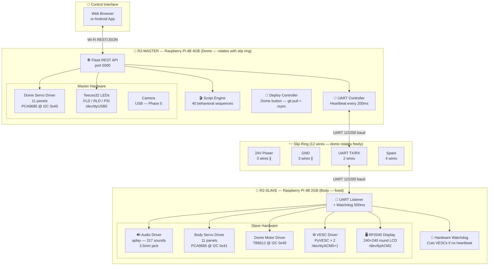
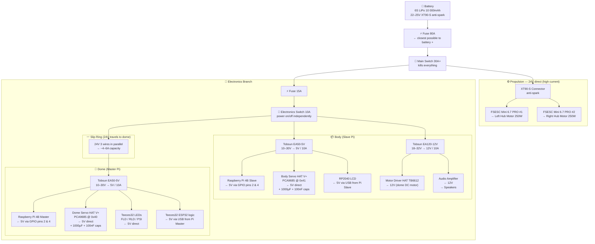
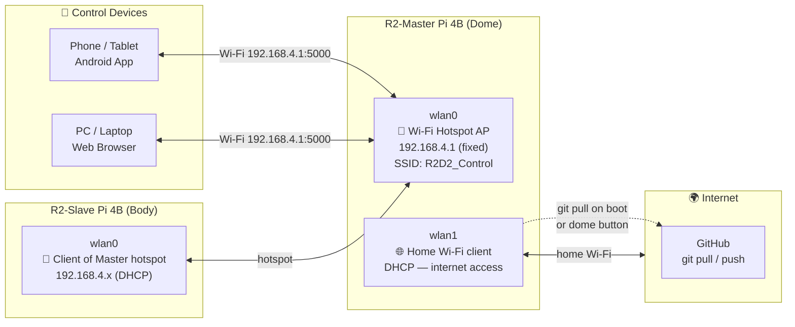
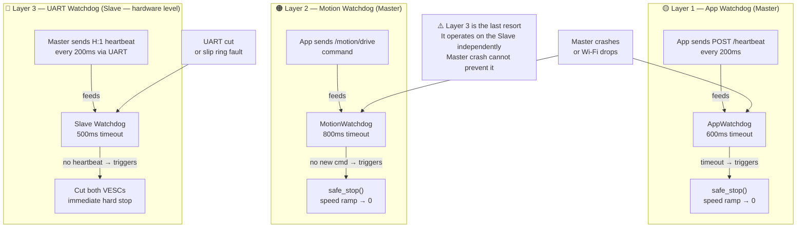

# R2D2_Control — Electronics & Wiring Reference

Complete wiring diagrams, power distribution, and communication architecture for the R2-D2 Master/Slave control system.

---

## Table of Contents

- [System Architecture](#1-system-architecture)
- [Power Distribution](#2-power-distribution)
- [Slip Ring Wiring](#3-slip-ring-wiring)
- [Network Topology](#4-network-topology)
- [3-Layer Safety System](#5-3-layer-safety-system)
- [I2C & GPIO Reference](#6-i2c--gpio-reference)
- [UART Protocol](#7-uart-protocol-reference)
- [Component Notes](#8-component-notes)

---

## 1. System Architecture

All hardware connections — software components, communication buses, and peripherals.



---

## 2. Power Distribution

Battery → fuses → switches → bucks → every powered component.



> **Power-on sequence:**
> 1. Connect battery → plug XT90-S last (anti-spark for VESCs)
> 2. Flip main switch → Pi boots (~30s)
> 3. Plug XT90-S → VESCs power up safely

---

## 3. Slip Ring Wiring

The dome rotates freely. All signals and power pass through a 12-wire slip ring.

| Wire | Signal | Notes |
|------|--------|-------|
| 1, 2, 3 | **24V +** | 3 wires in parallel → ~4–6A total capacity |
| 4, 5, 6 | **GND** | 3 wires in parallel |
| 7 | **UART TX** | Slave (body) → Master (dome) |
| 8 | **UART RX** | Master (dome) → Slave (body) |
| 9–12 | **Spare** | Reserved for future use (camera USB, etc.) |

> **UART wiring rule — always cross TX↔RX:**
> ```
> Master BCM14 (TX) ──→  BCM15 (RX) Slave
> Master BCM15 (RX) ←──  BCM14 (TX) Slave
> Master GND        ───  GND         Slave
> ```

---

## 4. Network Topology



---

## 5. 3-Layer Safety System

Three independent watchdogs ensure motors stop even if any part of the system crashes.



---

## 6. I2C & GPIO Reference

### I2C Addresses

| Pi | Bus | Address | Component | Purpose |
|----|-----|---------|-----------|---------|
| Master (Dome) | I2C-1 | **0x40** | Waveshare Servo Driver HAT | 11 dome panel servos (ch 0–10) |
| Slave (Body) | I2C-1 | **0x40** | Waveshare Motor Driver HAT (TB6612) | Dome rotation DC motor |
| Slave (Body) | I2C-1 | **0x41** | PCA9685 Breakout | 11 body panel servos (ch 0–10) |

### GPIO Pins — both Pi 4B

| BCM | Function | Notes |
|-----|----------|-------|
| **2** | I2C SDA | I2C bus |
| **3** | I2C SCL | I2C bus |
| **14** | UART TX | → slip ring → other Pi RX |
| **15** | UART RX | ← slip ring ← other Pi TX |
| **2, 4** | 5V power in | GPIO header pins — Pi powered from buck (bypass USB-C) |
| **XX** | Dome button | BCM pin TBD — configure in `local.cfg [deploy] button_pin` |

### USB Ports — Slave Pi

| Port | Device | Driver |
|------|--------|--------|
| `/dev/ttyACM0` | FSESC Mini 6.7 PRO #1 | PyVESC |
| `/dev/ttyACM1` | FSESC Mini 6.7 PRO #2 | PyVESC |
| `/dev/ttyACM2` | RP2040 Touch LCD 1.28" | Serial → MicroPython |

### USB Ports — Master Pi

| Port | Device | Driver |
|------|--------|--------|
| `/dev/ttyUSB0` | Teeces32 ESP32 | JawaLite 9600 baud |

### Servo PWM Values — SG90 360° (current, temporary)

| Pulse | Effect |
|-------|--------|
| **1700µs** | STOP (actual neutral — non-standard) |
| **2000µs** | Open direction — slow (~300µs above stop) |
| **1000µs** | Close direction — fast (~700µs below stop, 2.3× faster) |

> ⚠️ SG90 360° asymmetry: close is 2.3× faster than open. Compensate via **Settings → Servo Calibration** — set `close_angle` ≈ `open_angle / 2.3`.
> This goes away when MG90S 180° standard servos are installed — they use direct angle control.

---

## 7. UART Protocol Reference

All messages follow this format over `/dev/ttyAMA0` at **115200 baud**:

```
TYPE:VALUE:CRC\n
```

CRC = XOR of all bytes in `TYPE:VALUE`.

### Message Types

| Type | Direction | Format | Description |
|------|-----------|--------|-------------|
| `H` | M→S | `H:1:CRC` | Heartbeat (every 200ms) |
| `H` | S→M | `H:OK:CRC` | Heartbeat ACK |
| `M` | M→S | `M:0.5,0.5:CRC` | Drive — left/right float [-1.0…1.0] |
| `D` | M→S | `D:0.3:CRC` | Dome motor speed float [-1.0…1.0] |
| `SRV` | M→S | `SRV:body_panel_1,1.0,500:CRC` | Servo — name, position, duration ms |
| `S` | M→S | `S:Happy001:CRC` | Play specific sound |
| `S` | M→S | `S:RANDOM:happy:CRC` | Play random sound by category |
| `S` | M→S | `S:STOP:CRC` | Stop audio |
| `V` | S→M | `V:?:CRC` | Version request |
| `V` | M→S | `V:abc123:CRC` | Version reply (git hash) |
| `T` | S→M | `T:VOLT:48.2:TEMP:32:CRC` | Telemetry |
| `DISP` | M→S | `DISP:OK:abc123:CRC` | RP2040 display command |
| `REBOOT` | M→S | `REBOOT:1:CRC` | Reboot Slave |

---

## 8. Component Notes

### Tobsun EA50-5V (5V / 10A Buck)
- Input: **10–30V** (covers 6S LiPo 22–25V)
- Output: 5V / 10A = 50W
- Used: one in body (Pi Slave + Servo HAT body), one in dome (Pi Master + Servo HAT dome)

### Tobsun EA120-12V (12V / 10A Buck)
- Input: **18–32V** (covers 6S LiPo 22–25V)
- Output: 12V / 10A = 120W
- Used: one in body (Motor HAT + Audio Amplifier)

### Capacitors on Servo HAT V+ input
- **1000µF 10V** (or 16V) electrolytic — absorbs current spikes at servo start/reverse
- **100nF** ceramic in parallel — filters high-frequency PWM noise
- Install as close as possible to the HAT V+ and GND terminals
- Only needed on servo HAT rails (shared with Pi 5V) — Motor HAT on 12V is isolated

### Pi 4B GPIO Power
The Pi 4B **is not powered by the HAT** — the HAT takes its logic power from the Pi.
Both Pi 4B units receive 5V directly from their respective buck converters via **GPIO pins 2 & 4** (bypassing USB-C).

### FSESC Mini 6.7 PRO
- Supports 4–13S LiPo — 6S 24V is well within spec
- Connect via XT90-S last (after main switch) to avoid spark on capacitor inrush
- Controlled via PyVESC over USB serial (`SetDutyCycle` commands)

### Hub Motors 250W / 24V
- Rated 250W peak — typical casual use ~20–30W each
- Double shaft — fits standard R2-D2 leg wheel mounts
- Requires soft speed ramps — hard stops risk tipping the robot

---

*For installation instructions, see [HOWTO.md](HOWTO.md).*
*For project overview and screenshots, see [README.md](README.md).*
