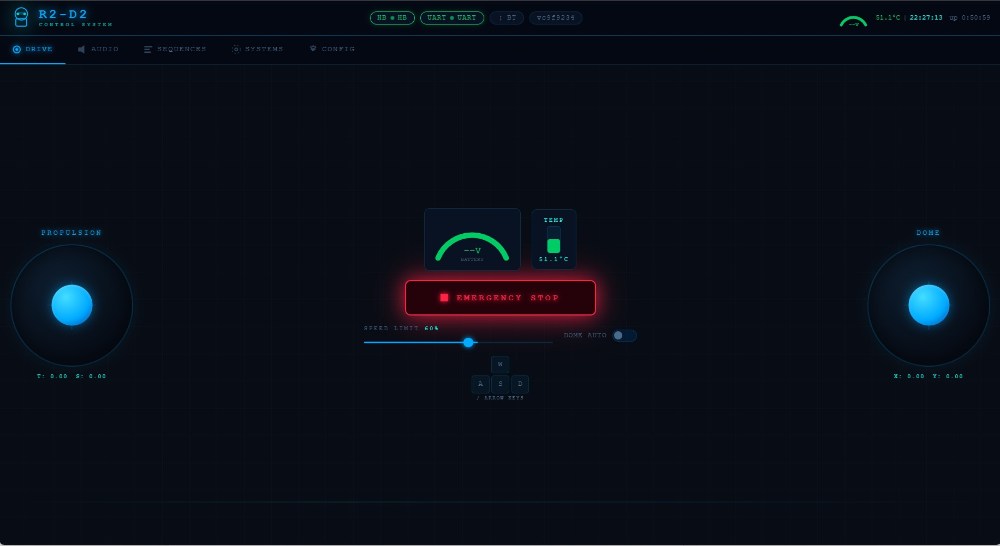
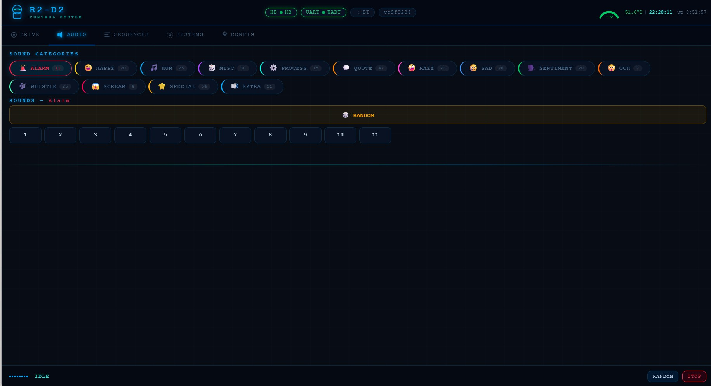
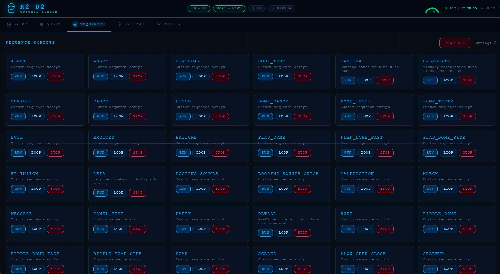
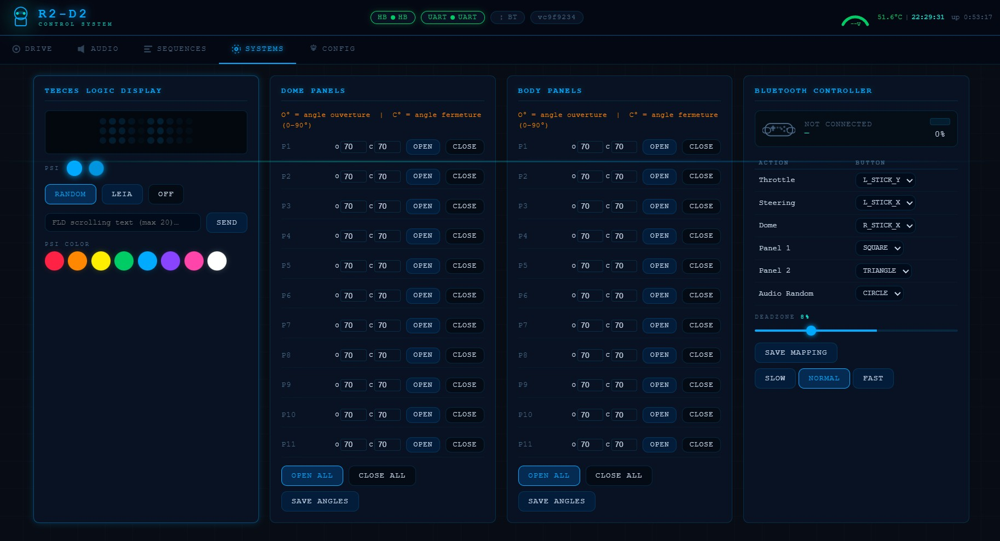
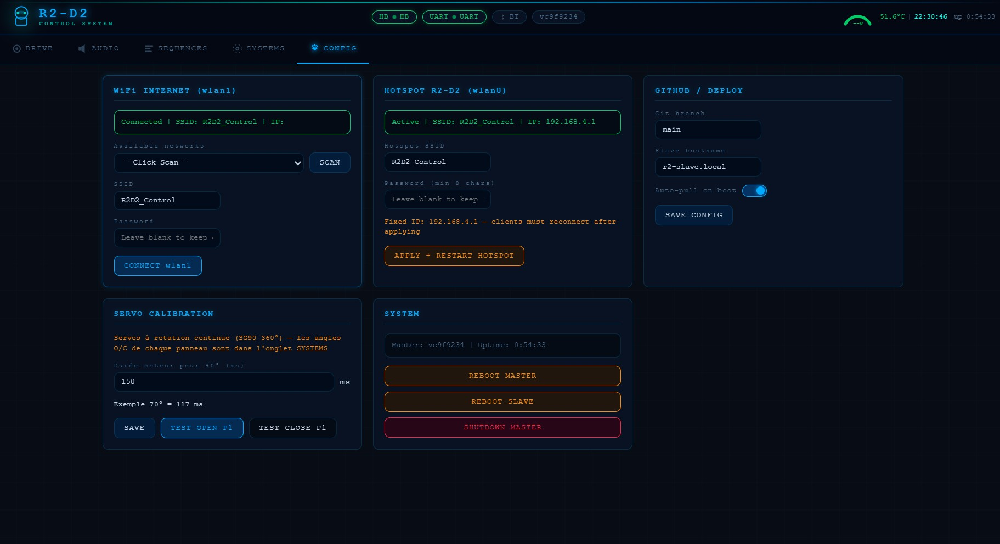

<div align="center">

# 🤖 R2D2_Control

**Full-scale R2-D2 replica — distributed control system on two Raspberry Pi 4B**

[](LICENSE)
[](https://python.org)
[](https://www.raspberrypi.com/)
[](ELECTRONICS.md)
[](android/compiled/)

*Master/Slave architecture · UART through slip ring · Web dashboard · Android app · 317 R2-D2 sounds · 40 behavior scripts*

</div>

---

> **Alpha Phase** — Software is complete and actively tested on bench hardware. Physical assembly (3D-printed parts, slip ring, final wiring) is in progress. No camera stream yet.

---

## Screenshots

<table>
<tr>
<td align="center" width="50%">

### 🕹️ Drive
Dual joystick · WASD keyboard · Emergency stop · Battery gauge



</td>
<td align="center" width="50%">

### 🔊 Audio
317 R2-D2 sounds · 14 mood categories · Random or specific



</td>
</tr>
<tr>
<td align="center" width="50%">

### 🎬 Sequences
40 behavioral scripts · Run once or loop · Patrol, Cantina, Leia, Evil…



</td>
<td align="center" width="50%">

### ⚙️ Systems & Servos
Teeces32 LEDs · 11 dome panels · 11 body panels · Bluetooth mapping



</td>
</tr>
<tr>
<td align="center" colspan="2">

### 🔧 Configuration
Per-panel servo calibration · Wi-Fi settings · Auto-deploy · System controls



</td>
</tr>
</table>

---

## What is this?

A complete control system for a **1:1 scale R2-D2 replica**, built around a Master/Slave architecture:

- **Master Pi** (dome) — web server, dome servos, LED logics, script engine, deploy controller
- **Slave Pi** (body) — drive motors, body servos, dome rotation, audio, diagnostic display
- They talk over a **physical UART through the dome slip ring**, with a hardware watchdog that cuts the drive motors if the link is lost

The web dashboard runs on the Master and is accessible from any phone or PC on the local Wi-Fi hotspot. An Android app wraps the same interface with native offline detection and auto-discovery.

---

## Features

### Control
- 🕹️ **Dual joystick web interface** — mobile-first, WASD keyboard support
- 📱 **Android app** — bundled offline assets, auto-discovers Master on network
- 🎮 **Bluetooth controller mapping** — configurable button/axis assignments

### Motion
- ⚙️ **2× FSESC Mini 6.7 PRO** — PyVESC over USB, 24V hub motors 250W
- 🎩 **Dome rotation** — DC motor via TB6612 Motor HAT, random mode
- 🦾 **22 servo panels** — 11 dome + 11 body, individually calibrated open/close angles

### Audio & Lights
- 🔊 **317 R2-D2 sounds** in 14 categories (happy, sad, alarm, scream, Cantina, Leia…)
- 💡 **Teeces32 LED logics** — FLD/RLD/PSI, random mode, Leia mode, scrolling text
- 🖥️ **RP2040 round LCD** — 240×240 diagnostic display (boot/sync/error/telemetry)

### Automation
- 🎬 **40 behavioral scripts** — .scr CSV format, run in background threads
  - 26 faithful ports from [dpoulson/r2_control](https://github.com/dpoulson/r2_control)
  - 14 custom sequences (patrol, celebrate, birthday, disco, taunt, scan…)

### Safety
- 🛑 **3-layer watchdog system** — app heartbeat (600ms) + drive timeout (800ms) + UART watchdog (500ms)
- 📉 **Graceful deceleration** — speed ramps to 0 on any watchdog trip, no hard stops at speed
- 🔄 **I2C bus recovery** — automatic re-init after 3 consecutive errors

### DevOps
- 🚀 **One-button deploy** — dome button triggers git pull + rsync to Slave + reboot
- 📦 **Auto-update on boot** — git pull if internet available, version sync via UART
- 🔁 **Rollback** — long press dome button → `git checkout HEAD^`
- 📋 **Persistent logs** — rotating log files survive reboots

---

## Architecture

```
┌─────────────────────────────────────────────────────────────────┐
│  📱 Phone / PC  ←── Wi-Fi (192.168.4.1:5000) ──→  🎩 MASTER Pi  │
│                                                                  │
│  R2-MASTER (Dome — rotates)          R2-SLAVE (Body — fixed)    │
│  ├─ Flask REST API :5000             ├─ UART listener            │
│  ├─ Script engine (40 sequences)     ├─ Watchdog 500ms → VESCs  │
│  ├─ Dome servos   I2C 0x40          ├─ Body servos  I2C 0x41   │
│  ├─ Teeces32 LEDs USB               ├─ Dome motor   I2C 0x40   │
│  └─ Deploy controller               ├─ Drive VESCs  USB ×2     │
│                                     ├─ Audio        3.5mm jack  │
│         UART 115200 baud            └─ RP2040 LCD   USB        │
│    ←─── through slip ring ────►                                 │
│    (heartbeat every 200ms)                                      │
└─────────────────────────────────────────────────────────────────┘
```

### Hardware at a glance

| | **Master Pi 4B 4GB** (Dome) | **Slave Pi 4B 2GB** (Body) |
|---|---|---|
| **Servos** | 11 dome panels — PCA9685 @ I2C 0x40 | 11 body panels — PCA9685 @ I2C 0x41 |
| **Motors** | — | 2× 250W hub motors via FSESC VESCs |
| **Dome motor** | — | DC motor via TB6612 HAT @ I2C 0x40 |
| **LEDs** | Teeces32 FLD/RLD/PSI via USB | — |
| **Audio** | — | 317 sounds, 3.5mm jack native |
| **Display** | — | RP2040 240×240 round LCD |
| **Power** | 5V/10A buck via GPIO 2&4 | 5V/10A + 12V/10A bucks |

📐 **[Full electronics diagrams, power wiring & protocol reference →](ELECTRONICS.md)**

---

## Quick Start

### Prerequisites
- 2× Raspberry Pi 4B (username: `artoo` — set in Raspberry Pi Imager)
- Both running Raspberry Pi OS Trixie (64-bit)
- A USB Wi-Fi adapter for the Master Pi (for internet while hosting hotspot)

### Installation

```bash
# On Master Pi — configure network (Wi-Fi hotspot + internet)
bash scripts/setup_master_network.sh

# On Slave Pi — connect to Master hotspot
bash scripts/setup_slave_network.sh

# On Master Pi — passwordless SSH for auto-deploy
bash scripts/setup_ssh_keys.sh

# Enable services
sudo systemctl enable r2d2-master.service r2d2-monitor.service
sudo systemctl enable r2d2-slave.service   # on Slave Pi
```

Access the dashboard at **`http://192.168.4.1:5000`** or **`http://r2-master.local:5000`**

📖 **[Full installation guide (French) →](HOWTO.md)**

### Android App

Download [`android/compiled/R2-D2_Control.apk`](android/compiled/R2-D2_Control.apk), enable *Install from unknown sources*, install and launch. The app auto-discovers the Master Pi on the network.

---

## Repository Structure

```
r2d2/
├── master/              — Master Pi (dome)
│   ├── main.py          — Boot sequence, all phases
│   ├── drivers/         — VescDriver, DomeMotorDriver, DomeServoDriver, BodyServoDriver
│   ├── api/             — Flask blueprints (audio, motion, servo, scripts, teeces, status)
│   ├── scripts/         — 40 behavioral scripts (.scr)
│   ├── templates/       — Web dashboard HTML (dark theme)
│   └── static/          — CSS + JavaScript
├── slave/               — Slave Pi (body)
│   ├── main.py
│   ├── drivers/         — AudioDriver, DisplayDriver, VescDriver, BodyServoDriver
│   └── sounds/          — sounds_index.json (MP3 files gitignored — stored on Pi only)
├── shared/              — uart_protocol.py (CRC-XOR), base_driver.py
├── rp2040/              — MicroPython firmware for diagnostic display
├── android/             — Android app (WebView wrapper)
│   └── compiled/        — R2-D2_Control.apk  ← ready to install
├── scripts/             — deploy.sh, setup_*.sh, vendor_deps.sh
├── Screenshots/         — Web interface screenshots
├── ELECTRONICS.md       — 📐 Full wiring diagrams & protocol reference
└── HOWTO.md             — 📖 Installation guide (French)
```

---

## Development Roadmap

| Phase | Description | Status |
|-------|-------------|--------|
| **1** | Infrastructure: UART, heartbeat watchdog, audio, Teeces32, RP2040, deploy | ✅ Complete — bench tested |
| **2** | Propulsion: VESCs, dome motor, servo panels | 🔧 Code ready — hardware assembly in progress |
| **3** | Script engine: 40 behavioral sequences | ✅ Active |
| **4** | REST API + Web dashboard + Android app | ✅ Active |
| **5** | Vision: USB camera, person tracking | 📋 Planned |

> Physical assembly is in progress — 3D parts printing, slip ring ordered.
> All current testing is on bench with direct BCM14/15 UART wiring.

---

## Credits & Inspiration

- Sound library and script format inspired by **[r2_control by dpoulson](https://github.com/dpoulson/r2_control)** — 306 R2-D2 sounds + script thread concept
- R2-D2 Builders Club community for hardware knowledge

## License

**GNU GPL v3** — see [LICENSE](LICENSE).
Free to use, modify and share — keep it open source.

---

<div align="center">

*May the Force be with you.* 🌟

</div>
